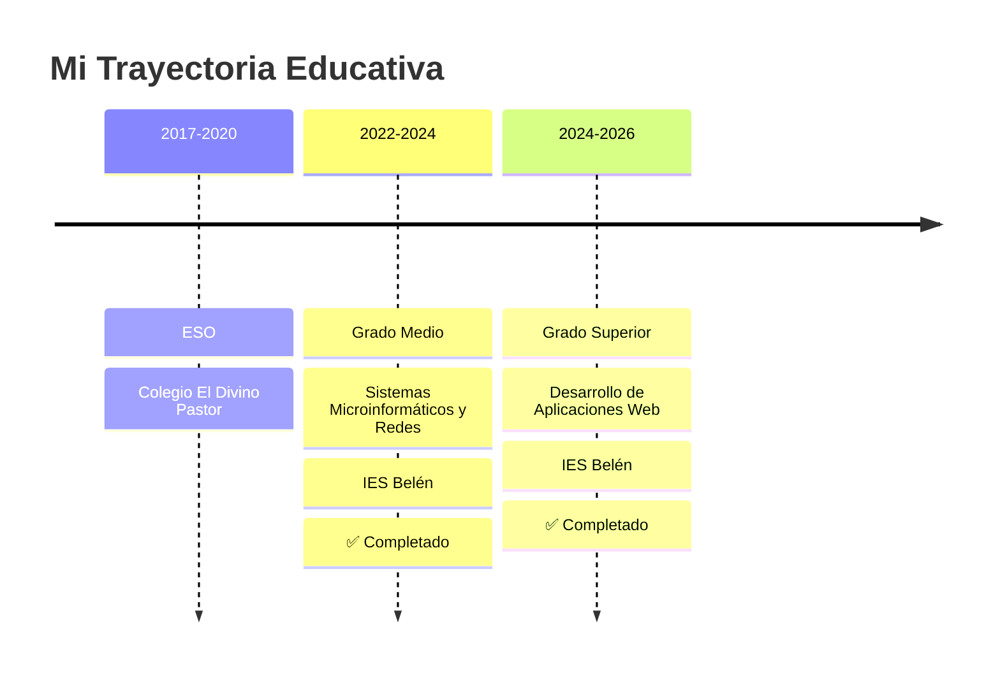

<div align="center">
  
</div>

<div align="center">
  
  ### 💻 Desarrollador Web Full-Stack | 🎓 Técnico Superior DAW | 🚀 Tech Entrepreneur
  
  [](https://github.com/raaulroodriguez)
  [](https://www.linkedin.com/in/tu-perfil)
  [](mailto:raulrodriguezaponte1@gmail.com)
  
  📍 Málaga, España | 🎂 20 años | 🎓 Graduado en DAW
  
</div>

---

## 👨‍💻 Sobre mí

```javascript
const raul = {
    ubicacion: "Málaga, España 🇪🇸",
    edad: 20,
    role: "Desarrollador Web Full-Stack",
    education: {
        titulo: "Técnico Superior en Desarrollo de Aplicaciones Web",
        centro: "IES Belén",
        periodo: "2024 - 2026",
        estado: "✅ Completado"
    },
    trabajo: {
        puesto: "Heladero y Dependiente",
        empresa: "Gelateria Di Amore",
        desde: "Marzo 2024"
    },
    pasiones: ["Programación", "Gaming", "Hardware", "Emprendimiento"],
    objetivos: "Lanzar mi propio negocio tecnológico",
    disponibilidad: "Disponible para nuevas oportunidades"
};
```

---

## 🎓 Perfil Profesional

> **Técnico Superior en Desarrollo de Aplicaciones Web** con sólida formación en desarrollo full-stack y experiencia práctica en gestión de proyectos reales. Especializado en crear soluciones web escalables y eficientes, combinando conocimientos técnicos con habilidades de atención al cliente adquiridas en entorno de alta demanda. Busco integrarme en equipos innovadores donde pueda aportar mi capacidad de resolución de problemas, adaptabilidad y pasión por la tecnología.

**🔑 Fortalezas:**
- ✅ Desarrollo full-stack con Java, Angular y bases de datos relacionales
- ✅ Experiencia en diseño e implementación de APIs REST
- ✅ Gestión de proyectos desde la concepción hasta el despliegue
- ✅ Trabajo bajo presión y adaptación a entornos cambiantes
- ✅ Mentalidad emprendedora y orientación a resultados

---

## 🛠️ Stack Tecnológico

### 💻 Lenguajes de Programación
<p>
  
  
  
  
</p>

### 🎨 Frontend
<p>
  
  
  
</p>

### ⚙️ Backend & Bases de Datos
<p>
  
  
  
</p>

### 🔧 Herramientas & Otros
<p>
  
  
  
  
  
  
</p>

---

## 📊 Estadísticas de GitHub

<div align="center">
  
  
</div>

<div align="center">
  
</div>

<div align="center">
  
</div>

---

## 🚀 Proyectos Destacados

<div align="center">
  
  [](https://github.com/raaulroodriguez/orbit-control)
  
  ### 🎯 Orbit Control
  Sistema de gestión integral para heladerías
  
  **Tecnologías:** Java Servlets | Angular | PostgreSQL | Vercel
  
  ✨ Control de inventario | 📦 Gestión de almacén | 📊 Análisis de ventas | 🔔 Notificaciones WhatsApp
  
</div>

---

## 💼 Experiencia Profesional

### 🍦 Gelateria Di Amore
**Heladero y Dependiente** | Marzo 2024 - Actualidad
- 🎨 Elaboración artesanal de helados y paletas
- 👥 Atención al cliente en zona de alta afluencia turística
- 💰 Gestión de punto de venta
- 📈 Trabajo bajo presión en temporada alta

### 💻 Técnico Informático Freelance
**Soporte Técnico** | 2020 - Actualidad
- 🖥️ Montaje, reparación y mantenimiento de equipos
- 🔧 Instalación y configuración de sistemas operativos
- 🌐 Administración de redes locales
- 👨‍👩‍👧‍👦 Soporte a familiares y amigos

---

## 🎓 Formación Académica



---

## 🌟 Soft Skills

<div align="center">

| 💡 Competencia | 📊 Nivel |
|---|---|
| Trabajo en equipo | ⭐⭐⭐⭐⭐ |
| Resolución de problemas | ⭐⭐⭐⭐⭐ |
| Adaptabilidad | ⭐⭐⭐⭐⭐ |
| Gestión del tiempo | ⭐⭐⭐⭐ |
| Atención al cliente | ⭐⭐⭐⭐⭐ |
| Aprendizaje continuo | ⭐⭐⭐⭐⭐ |

</div>

---

## 🎯 Objetivos 2026-2027

- [ ] 💼 Incorporarme a una empresa tecnológica innovadora
- [ ] 🚀 Lanzar Orbit Control como producto comercial
- [ ] 🏢 Iniciar mi primer negocio: desarrollo de software a medida
- [ ] 📚 Especializarme en arquitecturas cloud (AWS/Azure)
- [ ] 🌐 Contribuir activamente a proyectos open source
- [ ] 📱 Desarrollar una app móvil rentable
- [ ] 💰 Consolidar mi estrategia de inversión a largo plazo

---

## 🎮 Intereses Personales

<div align="center">
  
  🎮 **Gaming** | 🖥️ **Hardware Tech** | 💰 **Inversión** | 🍦 **Gastronomía** | 🏍️ **Motos**
  
  ### Juegos Favoritos
  
  
  
</div>

---

## 📫 Contacto

<div align="center">
  
  ¿Quieres colaborar en algún proyecto o simplemente charlar sobre tecnología?
  
  [](mailto:raulrodriguezaponte1@gmail.com)
  [](https://github.com/raaulroodriguez)
  [](https://www.linkedin.com/in/tu-perfil)
  
  📱 **Teléfono:** 611 15 49 88
  
</div>

---

## 💭 Cita Favorita

<div align="center">
  
  > *"El único modo de hacer un gran trabajo es amar lo que haces"*
  > 
  > — Steve Jobs
  
</div>

---

<div align="center">
  
  ### 🌊 ¡Gracias por visitar mi perfil!
  
  
  
  
  
</div>
