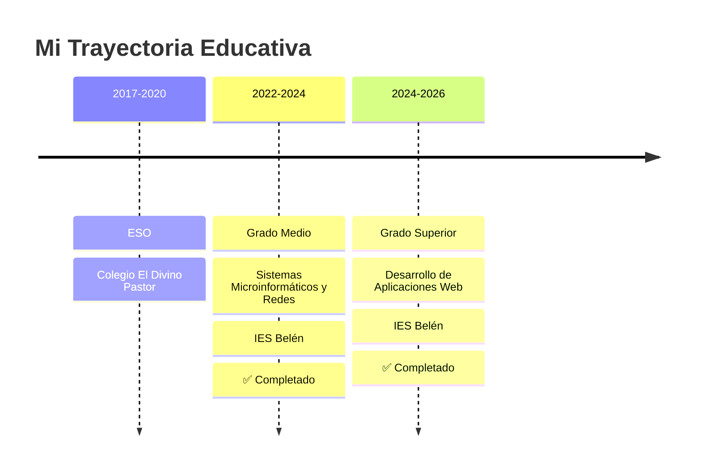

<div align="center">
  
</div>

<div align="center">
  
   💻 Desarrollador Web Full-Stack | 🎓 Técnico Superior DAW | 🚀 Tech Entrepreneur
  
  [](https://github.com/raaulroodriguez)
  [](https://www.linkedin.com/in/tu-perfil)
  [](mailto:raulrodriguezaponte1@gmail.com)
  
  📍 Málaga, España | 🎂 20 años | 🎓 Graduado en DAW
  
</div>

---

 👨‍💻 Sobre mí

```javascript
const raul = {
    ubicacion: "Málaga, España 🇪🇸",
    edad: 20,
    role: "Desarrollador Web Full-Stack",
    education: {
        titulo: "Técnico Superior en Desarrollo de Aplicaciones Web",
        centro: "IES Belén",
        periodo: "2024 - 2026",
        estado: "✅ Completado"
    },
    trabajo: {
        puesto: "Heladero y Dependiente",
        empresa: "Gelateria Di Amore",
        desde: "Marzo 2024"
    },
    pasiones: ["Programación", "Gaming", "Hardware", "Emprendimiento"],
    objetivos: "Lanzar mi propio negocio tecnológico",
    disponibilidad: "Disponible para nuevas oportunidades"
};
```

---

 🎓 Perfil Profesional

> Desarrollador full-stack recién graduado con pasión por crear soluciones web que funcionen de verdad. Me gusta combinar código limpio con buena experiencia de usuario, y tengo experiencia trabajando bajo presión y en equipo gracias a mi trabajo en hostelería. Siempre buscando aprender cosas nuevas y trabajar en proyectos que marquen la diferencia.

**🔑 Fortalezas:**
- ✅ Desarrollo full-stack con Java, Angular y bases de datos relacionales
- ✅ Experiencia en diseño e implementación de APIs REST
- ✅ Gestión de proyectos desde la concepción hasta el despliegue
- ✅ Trabajo bajo presión y adaptación a entornos cambiantes
- ✅ Mentalidad emprendedora y orientación a resultados

---

 🛠️ Stack Tecnológico

 💻 Lenguajes de Programación
<p>
  
  
  
  
</p>

 🎨 Frontend
<p>
  
  
  
</p>

 ⚙️ Backend & Bases de Datos
<p>
  
  
  
</p>

 🔧 Herramientas & Otros
<p>
  
  
  
  
  
  
</p>

---


 🚀 Proyectos Destacados

<div align="center">
    
   🎯 Orbit Control
   
  Sistema de gestión integral para heladerías
  
  **Tecnologías:** Spring Boot | Angular | MySQL | Vercel
  
  ✨ Control de inventario | 📦 Gestión de almacén | 📊 Análisis de ventas | 🔔 Notificaciones WhatsApp
  
</div>

---

 📂 Mis Repositorios

<div align="center">

 🌟 Proyectos Destacados

</div>

<table>
<tr>
<td width="50%" valign="top">

 🍦 [GestionHeladeria](https://github.com/raaulroodriguez/GestionHeladeria)

**Sistema de Gestión de Inventario en Producción**

Prototipo funcional de Orbit Control implementado y funcionando actualmente en Gelateria Di Amore. Sistema real de gestión de inventario de helados con base de datos PostgreSQL y notificaciones automáticas.

**🛠️ Stack Tecnológico:**
- 🔹 Frontend: JavaScript vanilla + HTML/CSS
- 🔹 Backend: Vercel Serverless Functions
- 🔹 Base de datos: Neon PostgreSQL
- 🔹 Notificaciones: Webhook N8N (Telegram)

**✨ Características (Módulo de Helados):**
- ➕ Crear y aumentar stock de productos
- ⬇️ Reducir inventario (ventas)
- 📋 Inventario completo con estadísticas
- 🔍 Filtrado por tipo de producto
- ⚠️ Sistema de alertas de stock bajo
- 📈 Historial de movimientos
- ⚙️ Ajustes manuales de stock
- 🏆 Ranking de productos más consumidos
- 🔔 Notificaciones automáticas por Telegram

**📊 Estado:** 🟢 En uso en Gelateria Di Amore

---

**📊 Lenguajes:**


[Ver repositorio →](https://github.com/raaulroodriguez/GestionHeladeria)

</td>
<br>
<td width="50%" valign="top">

 💪 [VitalFits](https://github.com/raaulroodriguez/VitalFits)

**Plataforma Web de Nutrición Saludable**

Proyecto final de Grado Medio: sitio web completo para una empresa de alimentación saludable. Incluye sistema de elaboración y consulta de dietas personalizadas, menú del día y gestión de usuarios.

**🛠️ Tecnologías principales:**
- 🔹 HTML5 puro
- 🔹 CSS3 (sin frameworks)
- 🔹 JavaScript vanilla
- 🔹 Font Awesome

**✨ Características:**
- Sistema de elaboración de dietas personalizadas
- Consulta y seguimiento de planes nutricionales
- Menú del día actualizable
- Sistema de login/registro de usuarios
- Sección de ubicación con integración de mapas
- Preguntas frecuentes interactivas
- Diseño responsive y navegación completa
- Slider automático de imágenes

---

**📊 Lenguaje principal:**


[Ver repositorio →](https://github.com/raaulroodriguez/VitalFits)

</td>
</tr>

<tr>
<td width="50%" valign="top">

 🌐 [GelateriaDiAmoreWeb](https://github.com/raaulroodriguez/GelateriaDiAmoreWeb)

**Proyecto Web Académico**

Sitio web creado para una heladería como proyecto del módulo de Interfaces Web. Desarrollo front-end puro utilizando únicamente HTML5 y CSS3, sin frameworks.

**🛠️ Tecnologías principales:**
- 🔹 HTML5 puro
- 🔹 CSS3 (sin frameworks)
- 🔹 Diseño responsive

**✨ Características:**
- Diseño visual atractivo
- Maquetación responsive
- Código semántico y limpio
- Proyecto académico del módulo de Interfaces Web

---

**📊 Lenguaje principal:**


[Ver repositorio →](https://github.com/raaulroodriguez/GelateriaDiAmoreWeb)

</td>
<td width="50%" valign="top">

 👤 [raaulroodriguez](https://github.com/raaulroodriguez/raaulroodriguez)

**Mi Perfil de GitHub**

Repositorio especial que contiene el README de mi perfil de GitHub. Aquí muestro información sobre mí, mis habilidades y proyectos.

**🛠️ Tecnologías:**
- 🔹 Markdown
- 🔹 GitHub Profile README
- 🔹 Badges y estadísticas

**✨ Contenido:**
- Perfil profesional
- Stack tecnológico
- Proyectos destacados
- Información de contacto

---

**📊 Contenido:**


[Ver repositorio →](https://github.com/raaulroodriguez/raaulroodriguez)

</td>
</tr>
</table>

<div align="center">

 📚 Explora Todos Mis Proyectos

[](https://github.com/raaulroodriguez?tab=repositories)

</div>

---

 💼 Experiencia Profesional

 🍦 Gelateria Di Amore
**Heladero y Dependiente** | Marzo 2024 - Actualidad
- 🎨 Elaboración artesanal de helados y paletas
- 👥 Atención al cliente en zona de alta afluencia turística
- 💰 Gestión de punto de venta
- 📈 Trabajo bajo presión en temporada alta

 💻 Técnico Informático Freelance
**Soporte Técnico** | 2020 - Actualidad
- 🖥️ Montaje, reparación y mantenimiento de equipos
- 🔧 Instalación y configuración de sistemas operativos
- 🌐 Administración de redes locales
- 👨‍👩‍👧‍👦 Soporte a familiares y amigos

---

 🎓 Formación Académica



---

 🌟 raaulroodriguez.json
 
```javascript
const raaulRoodriguezSkills = {
    softSkills: [
        "Resolución de problemas",
        "Trabajo en equipo",
        "Aprendizaje rápido",
        "Adaptabilidad"
    ],
    experienciaExtra: {
        hosteleria: "Habilidades desarrolladas bajo presión en entornos de alta demanda 🍦",
        hardware: "Soporte técnico integral y montaje de equipos 🖥️"
    },
    idiomas: {
        español: "Nativo 🇪🇸",
        ingles: "B1 - Trinity College London 🇬🇧"
    },
    estado: "Aprendiendo y construyendo 🚀",
    mentalidad: "Siempre buscando nuevos retos",
    disponibilidad: "Abierto a oportunidades"
};
```

---

 📫 Contacto

<div align="center">
  
  ¿Quieres colaborar en algún proyecto o simplemente charlar sobre tecnología?
  
  [](mailto:raulrodriguezaponte1@gmail.com)
  [](https://github.com/raaulroodriguez)
  [](https://www.linkedin.com/in/tu-perfil)
  
</div>

---

 💭 Cita Favorita

<div align="center">
  
  > *"El único modo de hacer un gran trabajo es amar lo que haces"*
  > 
  > — Steve Jobs
  
</div>

---

<div align="center">
  
   🌊 ¡Gracias por visitar mi perfil!
    
</div>
