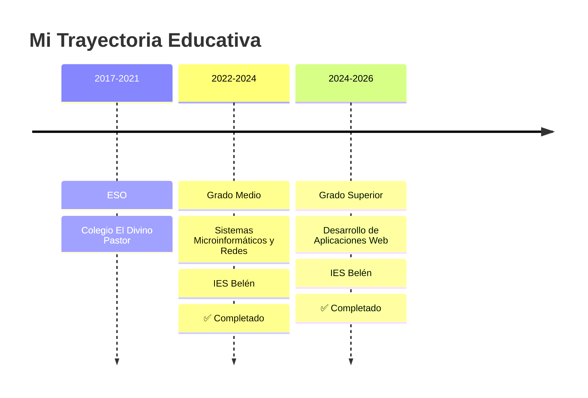

<div align="center">
  
</div>

<div align="center">

  🛠️ Full-Stack Developer | 🍦 Fundador de OrbitControl | 📍 Málaga

  [](https://github.com/raaulroodriguez)
  [](https://www.linkedin.com/in/raúl-rodríguez-aponte-b354b8167/)
  [](mailto:raulrodriguezaponte1@gmail.com)

  📍 Málaga, España | 🎂 20 años | 🎓 Técnico Superior DAW

</div>

---

## 👨‍💻 Sobre mí

```javascript
const raul = {
    ubicacion: "Málaga, España 🇪🇸",
    edad: 20,
    role: "Desarrollador Web Full-Stack",
    education: {
        titulo: "Técnico Superior en Desarrollo de Aplicaciones Web",
        centro: "IES Belén",
        periodo: "2024 - 2026",
        estado: "✅ Completado"
    },
    trabajo: {
        puesto: "Heladero y Dependiente",
        empresa: "Gelateria Di Amore",
        desde: "Marzo 2024"
    },
    pasiones: ["Programación", "Gaming", "Hardware", "Emprendimiento"],
    objetivos: "Lanzar mi propio negocio tecnológico",
    disponibilidad: "Disponible para nuevas oportunidades"
};
```

---

## 🎓 Perfil Profesional

> Desarrollador full-stack recién graduado con pasión por crear soluciones web que funcionen de verdad. Me gusta combinar código limpio con buena experiencia de usuario, y tengo experiencia trabajando bajo presión y en equipo gracias a mi trabajo en hostelería. Siempre buscando aprender cosas nuevas y trabajar en proyectos que marquen la diferencia.

**🔑 Fortalezas:**
- ✅ Desarrollo full-stack con Java, Angular y bases de datos relacionales
- ✅ Experiencia en diseño e implementación de APIs REST
- ✅ Gestión de proyectos desde la concepción hasta el despliegue en producción real
- ✅ Configuración de infraestructura cloud: VPS, Nginx, SSL, CI/CD
- ✅ Trabajo bajo presión y adaptación a entornos cambiantes
- ✅ Mentalidad emprendedora y orientación a resultados

---

## 🛠️ Stack Tecnológico

### 💻 Lenguajes de Programación
<p>
  
  
  
  
  
</p>

### 🎨 Frontend
<p>
  
  
</p>

### ⚙️ Backend & Bases de Datos
<p>
  
  
</p>

### ☁️ Cloud & DevOps
<p>
  
  
  
  
  
</p>

### 🔧 Herramientas
<p>
  
  
  
  
  
</p>

---

## 🚀 Proyectos Destacados

<table>
<tr>
<td width="50%" valign="top">

### 🔒 OrbitControl
**Sistema SaaS de gestión para heladerías**

Aplicación web fullstack completa con arquitectura REST, autenticación JWT, gestión de roles y despliegue en producción real.

**🛠️ Stack:**
- 🔹 Backend: Spring Boot 3 + Java 21
- 🔹 Frontend: Angular 17 + Tailwind CSS
- 🔹 Base de datos: MySQL 8
- 🔹 Auth: JWT + BCrypt

**☁️ Infraestructura:**
- 🔹 VPS Hetzner (Ubuntu 24.04) con Nginx + SSL
- 🔹 Frontend: Vercel con CI/CD automático por rama
- 🔹 Entornos dev/prod separados con BBDDs independientes
- 🔹 Dominio propio: orbitcontrol.es

**✨ Funcionalidades:**
- 📅 Control de jornadas y fichajes (con RFID)
- 🍦 Trazabilidad de producción y recetas
- 📦 Gestión de pedidos a proveedores
- 💰 Cálculo de costes de elaboración
- 📊 Dashboard de consumos en tiempo real
- 👥 Gestión de empleados con roles

**📊 Estado:** 🟡 En desarrollo activo

🔒 Repositorio privado · [orbitcontrol.es](https://orbitcontrol.es)

</td>
<td width="50%" valign="top">

### 🍦 [GestionHeladeria](https://github.com/raaulroodriguez/GestionHeladeria)
**Sistema de Gestión de Inventario en Producción**

Prototipo funcional de Orbit Control implementado y funcionando actualmente en Gelateria Di Amore.

**🛠️ Stack:**
- 🔹 Frontend: JavaScript vanilla + HTML/CSS
- 🔹 Backend: Vercel Serverless Functions
- 🔹 Base de datos: Neon PostgreSQL
- 🔹 Notificaciones: Webhook N8N (Telegram)

**✨ Características:**
- ➕ Gestión de stock en tiempo real
- ⚠️ Alertas automáticas de stock bajo
- 📈 Historial de movimientos
- 🏆 Ranking de productos más consumidos
- 🔔 Notificaciones automáticas por Telegram

**📊 Estado:** 🟢 En uso en Gelateria Di Amore


[Ver repositorio →](https://github.com/raaulroodriguez/GestionHeladeria)

</td>
</tr>
<tr>
<td width="50%" valign="top">

### 💪 [VitalFits](https://github.com/raaulroodriguez/VitalFits)
**Plataforma Web de Nutrición Saludable**

Proyecto final de Grado Medio: sitio web completo para empresa de alimentación saludable.

**🛠️ Tecnologías:**
- 🔹 HTML5 puro
- 🔹 CSS3 (sin frameworks)
- 🔹 JavaScript vanilla

**✨ Características:**
- Sistema de elaboración de dietas personalizadas
- Menú del día actualizable
- Sistema de login/registro
- Diseño responsive completo


[Ver repositorio →](https://github.com/raaulroodriguez/VitalFits)

</td>
<td width="50%" valign="top">

### 🌐 [GelateriaDiAmoreWeb](https://github.com/raaulroodriguez/GelateriaDiAmoreWeb)
**Proyecto Web Académico**

Sitio web para heladería — proyecto del módulo de Interfaces Web.

**🛠️ Tecnologías:**
- 🔹 HTML5 puro
- 🔹 CSS3 (sin frameworks)
- 🔹 Diseño responsive


[Ver repositorio →](https://github.com/raaulroodriguez/GelateriaDiAmoreWeb)

</td>
</tr>
</table>

<div align="center">

[](https://github.com/raaulroodriguez?tab=repositories)

</div>

---

## 💼 Experiencia Profesional

### 🏢 Airzone — Corporación Empresarial Altra S.L.
**Desarrollador Web en Prácticas (FCT)** | Febrero 2026 - Actualidad
- 🔍 Auditoría de accesibilidad y responsividad de **Airzone Control** y **MyArea** con documentación detallada de incidencias
- ⚡ Análisis y resolución de problemas de rendimiento: peticiones redundantes, prefetch, recursos de APIs externas sustituidos por paquetes locales
- 🐛 Resolución de incidencias reales en **AirzoneControl** y **Airboard** (app interna de gestión): paginación, validaciones, SessionStorage → QueryParams
- 🧪 Testing con **Jest** sobre el repositorio de Airzone Cloud
- 📚 Formación en **Vue.js 3** (Composition API, Real World Vue 3) en VueMastery
- 🔀 Gestión del flujo de trabajo con **GitLab + Jira**: Pull Requests, code reviews con compañeros y despliegue a PRO
- 🛠️ Herramientas: Vue.js · Jest · GitLab · Jira · WorkDay · Airboard

### 🍦 Gelateria Di Amore
**Heladero y Dependiente** | Marzo 2024 - Actualidad
- 🎨 Elaboración artesanal de helados y paletas
- 👥 Atención al cliente en zona de alta afluencia turística
- 💰 Gestión de punto de venta
- 📈 Trabajo bajo presión en temporada alta

### 💻 Técnico Informático Freelance
**Soporte Técnico** | 2022 - Actualidad
- 🖥️ Montaje, reparación y mantenimiento de equipos
- 🔧 Instalación y configuración de sistemas operativos
- 🌐 Administración de redes locales

---

## 🎓 Formación Académica


```mermaid
timeline
    title Mi Trayectoria Educativa
    2017-2021 : ESO : Colegio El Divino Pastor
    2022-2024 : Grado Medio : Sistemas Microinformáticos y Redes : IES Belén : ✅ Completado
    2024-2026 : Grado Superior : Desarrollo de Aplicaciones Web : IES Belén : ✅ Completado
```

---

## 🌟 Más sobre mí

```javascript
const raaulRoodriguezSkills = {
    softSkills: [
        "Resolución de problemas",
        "Trabajo en equipo",
        "Aprendizaje rápido",
        "Adaptabilidad"
    ],
    idiomas: {
        español: "Nativo 🇪🇸",
        ingles: "B1 - Trinity College London 🇬🇧"
    },
    estado: "Aprendiendo y construyendo 🚀",
    disponibilidad: "Abierto a oportunidades"
};
```

---

## 📫 Contacto

<div align="center">

¿Quieres colaborar en algún proyecto o simplemente charlar sobre tecnología?

[](mailto:raulrodriguezaponte1@gmail.com)
[](https://github.com/raaulroodriguez)
[](https://www.linkedin.com/in/raúl-rodríguez-aponte-b354b8167/)

</div>

---

## 💭 Cita Favorita

<div align="center">

> *"El único modo de hacer un gran trabajo es amar lo que haces"*
>
> — Steve Jobs

</div>

---

<div align="center">
  
</div>
