<div align="center">
  
</div>

<div align="center">
  
  ### 💻 Desarrollador Web Full-Stack | 🎓 Técnico Superior DAW | 🚀 Tech Entrepreneur
  
  [](https://github.com/raaulroodriguez)
  [](https://www.linkedin.com/in/tu-perfil)
  [](mailto:raulrodriguezaponte1@gmail.com)
  
  📍 Málaga, España | 🎂 20 años | 🎓 Graduado en DAW
  
</div>

---

## 👨‍💻 Sobre mí

```javascript
const raul = {
    ubicacion: "Málaga, España 🇪🇸",
    edad: 20,
    role: "Desarrollador Web Full-Stack",
    education: {
        titulo: "Técnico Superior en Desarrollo de Aplicaciones Web",
        centro: "IES Belén",
        periodo: "2024 - 2026",
        estado: "✅ Completado"
    },
    trabajo: {
        puesto: "Heladero y Dependiente",
        empresa: "Gelateria Di Amore",
        desde: "Marzo 2024"
    },
    pasiones: ["Programación", "Gaming", "Hardware", "Emprendimiento"],
    objetivos: "Lanzar mi propio negocio tecnológico",
    disponibilidad: "Disponible para nuevas oportunidades"
};
```

---

## 🎓 Perfil Profesional

> **Técnico Superior en Desarrollo de Aplicaciones Web** con sólida formación en desarrollo full-stack y experiencia práctica en gestión de proyectos reales. Especializado en crear soluciones web escalables y eficientes, combinando conocimientos técnicos con habilidades de atención al cliente adquiridas en entorno de alta demanda. Busco integrarme en equipos innovadores donde pueda aportar mi capacidad de resolución de problemas, adaptabilidad y pasión por la tecnología.

**🔑 Fortalezas:**
- ✅ Desarrollo full-stack con Java, Angular y bases de datos relacionales
- ✅ Experiencia en diseño e implementación de APIs REST
- ✅ Gestión de proyectos desde la concepción hasta el despliegue
- ✅ Trabajo bajo presión y adaptación a entornos cambiantes
- ✅ Mentalidad emprendedora y orientación a resultados

---

## 🛠️ Stack Tecnológico

### 💻 Lenguajes de Programación
<p>
  
  
  
  
</p>

### 🎨 Frontend
<p>
  
  
  
</p>

### ⚙️ Backend & Bases de Datos
<p>
  
  
  
</p>

### 🔧 Herramientas & Otros
<p>
  
  
  
  
  
  
</p>

---

## 📂 Mis Repositorios

<div align="center">

### 🌟 Proyectos Principales

</div>

<table align="center">
<tr>
<td width="50%" valign="top">

### 🎯 [Orbit Control](https://github.com/raaulroodriguez/orbit-control)

**Sistema de Gestión para Heladerías**

Sistema completo de gestión empresarial desarrollado específicamente para el sector heladero. Incluye módulos de inventario, almacén, ventas y notificaciones automáticas.

**🛠️ Stack Tecnológico:**
- 🔹 Backend: Spring Boot + Java
- 🔹 Frontend: Angular + Tailwind CSS
- 🔹 Base de datos: MySQL
- 🔹 Deploy: Vercel
- 🔹 Notificaciones: WhatsApp API

**✨ Características:**
- Control de inventario en tiempo real
- Gestión de almacén y stock
- Análisis de ventas con gráficos
- Alertas automáticas de stock bajo
- Dashboard administrativo intuitivo
- Sistema de usuarios y permisos

---

**📊 Lenguajes:**


</td>
<td width="50%" valign="top">

### 🌐 [Portfolio Personal](https://github.com/raaulroodriguez/portfolio)

**Mi Sitio Web Personal**

Portfolio interactivo y responsivo donde muestro mis proyectos, habilidades y experiencia profesional. Diseñado con las últimas tecnologías web.

**🛠️ Stack Tecnológico:**
- 🔹 Framework: React.js
- 🔹 Estilos: Tailwind CSS
- 🔹 Animaciones: Framer Motion
- 🔹 Deploy: Vercel
- 🔹 Formulario: EmailJS

**✨ Características:**
- Diseño moderno y minimalista
- Animaciones fluidas
- Modo oscuro/claro
- Totalmente responsivo
- Formulario de contacto funcional
- Sección de blog técnico

---

**📊 Lenguajes:**


</td>
</tr>

<tr>
<td width="50%" valign="top">

### 🛒 [E-commerce Demo](https://github.com/raaulroodriguez/ecommerce-demo)

**Tienda Online Completa**

Aplicación de comercio electrónico full-stack con carrito de compras, pasarela de pago simulada y panel de administración.

**🛠️ Stack Tecnológico:**
- 🔹 Backend: Node.js + Express
- 🔹 Frontend: React + Redux
- 🔹 Base de datos: PostgreSQL
- 🔹 Autenticación: JWT
- 🔹 Pagos: Stripe API (simulado)

**✨ Características:**
- Catálogo de productos con filtros
- Carrito de compras persistente
- Sistema de autenticación seguro
- Panel admin para gestión
- Historial de pedidos
- Sistema de valoraciones

---

**📊 Lenguajes:**


</td>
<td width="50%" valign="top">

### 📝 [Task Manager API](https://github.com/raaulroodriguez/task-manager-api)

**API RESTful de Gestión de Tareas**

API robusta para gestión de tareas con autenticación, CRUD completo y documentación interactiva con Swagger.

**🛠️ Stack Tecnológico:**
- 🔹 Framework: Spring Boot
- 🔹 Base de datos: MySQL
- 🔹 Seguridad: Spring Security + JWT
- 🔹 Documentación: Swagger/OpenAPI
- 🔹 Testing: JUnit + Mockito

**✨ Características:**
- Endpoints RESTful completos
- Autenticación JWT
- Roles y permisos
- Documentación interactiva
- Validaciones robustas
- Test coverage > 80%

---

**📊 Lenguajes:**


</td>
</tr>

<tr>
<td width="50%" valign="top">

### 🎮 [Game Hub](https://github.com/raaulroodriguez/game-hub)

**Plataforma de Minijuegos**

Colección de juegos clásicos recreados con JavaScript vanilla: Snake, Tetris, Pong y más.

**🛠️ Stack Tecnológico:**
- 🔹 Lenguaje: JavaScript vanilla
- 🔹 Gráficos: HTML5 Canvas
- 🔹 Estilos: CSS3
- 🔹 Audio: Web Audio API

**✨ Características:**
- 5 juegos clásicos jugables
- Sistema de puntuación
- Ranking de mejores scores
- Controles responsivos
- Sin dependencias externas
- Código limpio y documentado

---

**📊 Lenguajes:**


</td>
<td width="50%" valign="top">

### 🔧 [Dev Tools Collection](https://github.com/raaulroodriguez/dev-tools)

**Herramientas de Desarrollo**

Colección de scripts y utilidades que uso en mi día a día como desarrollador.

**🛠️ Stack Tecnológico:**
- 🔹 Scripts: Bash + Python
- 🔹 Automatización: npm scripts
- 🔹 Configuraciones: JSON/YAML
- 🔹 Documentación: Markdown

**✨ Incluye:**
- Configuraciones de Git útiles
- Scripts de deployment
- Snippets de código
- Configuraciones de VSCode
- Aliases de terminal
- Templates de proyectos

---

**📊 Lenguajes:**


</td>
</tr>
</table>

<div align="center">

### 📚 Más Proyectos

[](https://github.com/raaulroodriguez?tab=repositories)

</div>

---

## 🚀 Proyectos Destacados

<div align="center">
  
  [](https://github.com/raaulroodriguez/orbit-control)
  
  ### 🎯 Orbit Control
  Sistema de gestión integral para heladerías
  
  **Tecnologías:** Java Servlets | Angular | PostgreSQL | Vercel
  
  ✨ Control de inventario | 📦 Gestión de almacén | 📊 Análisis de ventas | 🔔 Notificaciones WhatsApp
  
</div>

---

## 💼 Experiencia Profesional

### 🍦 Gelateria Di Amore
**Heladero y Dependiente** | Marzo 2024 - Actualidad
- 🎨 Elaboración artesanal de helados y paletas
- 👥 Atención al cliente en zona de alta afluencia turística
- 💰 Gestión de punto de venta
- 📈 Trabajo bajo presión en temporada alta

### 💻 Técnico Informático Freelance
**Soporte Técnico** | 2020 - Actualidad
- 🖥️ Montaje, reparación y mantenimiento de equipos
- 🔧 Instalación y configuración de sistemas operativos
- 🌐 Administración de redes locales
- 👨‍👩‍👧‍👦 Soporte a familiares y amigos

---

## 🎓 Formación Académica

```mermaid
timeline
    title Mi Trayectoria Educativa
    2017-2020 : ESO : Colegio El Divino Pastor
    2022-2024 : Grado Medio : Sistemas Microinformáticos y Redes : IES Belén : ✅ Completado
    2024-2026 : Grado Superior : Desarrollo de Aplicaciones Web : IES Belén : ✅ Completado
```



---

## 🌟 Soft Skills

<div align="center">

| 💡 Competencia | 📊 Nivel |
|---|---|
| Trabajo en equipo | ⭐⭐⭐⭐⭐ |
| Resolución de problemas | ⭐⭐⭐⭐⭐ |
| Adaptabilidad | ⭐⭐⭐⭐⭐ |
| Gestión del tiempo | ⭐⭐⭐⭐ |
| Atención al cliente | ⭐⭐⭐⭐⭐ |
| Aprendizaje continuo | ⭐⭐⭐⭐⭐ |

</div>

---

## 🎯 Objetivos 2026-2027

- [ ] 💼 Incorporarme a una empresa tecnológica innovadora
- [ ] 🚀 Lanzar Orbit Control como producto comercial
- [ ] 🏢 Iniciar mi primer negocio: desarrollo de software a medida
- [ ] 📚 Especializarme en arquitecturas cloud (AWS/Azure)
- [ ] 🌐 Contribuir activamente a proyectos open source
- [ ] 📱 Desarrollar una app móvil rentable
- [ ] 💰 Consolidar mi estrategia de inversión a largo plazo

---

## 🎮 Intereses Personales

<div align="center">
  
  🎮 **Gaming** | 🖥️ **Hardware Tech** | 💰 **Inversión** | 🍦 **Gastronomía** | 🏍️ **Motos**
  
  ### Juegos Favoritos
  
  
  
</div>

---

## 📫 Contacto

<div align="center">
  
  ¿Quieres colaborar en algún proyecto o simplemente charlar sobre tecnología?
  
  [](mailto:raulrodriguezaponte1@gmail.com)
  [](https://github.com/raaulroodriguez)
  [](https://www.linkedin.com/in/tu-perfil)
  
  📱 **Teléfono:** 611 15 49 88
  
</div>

---

## 💭 Cita Favorita

<div align="center">
  
  > *"El único modo de hacer un gran trabajo es amar lo que haces"*
  > 
  > — Steve Jobs
  
</div>

---

<div align="center">
  
  ### 🌊 ¡Gracias por visitar mi perfil!
  
  
  
  
  
</div>
